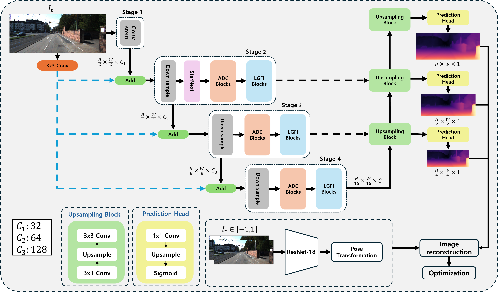
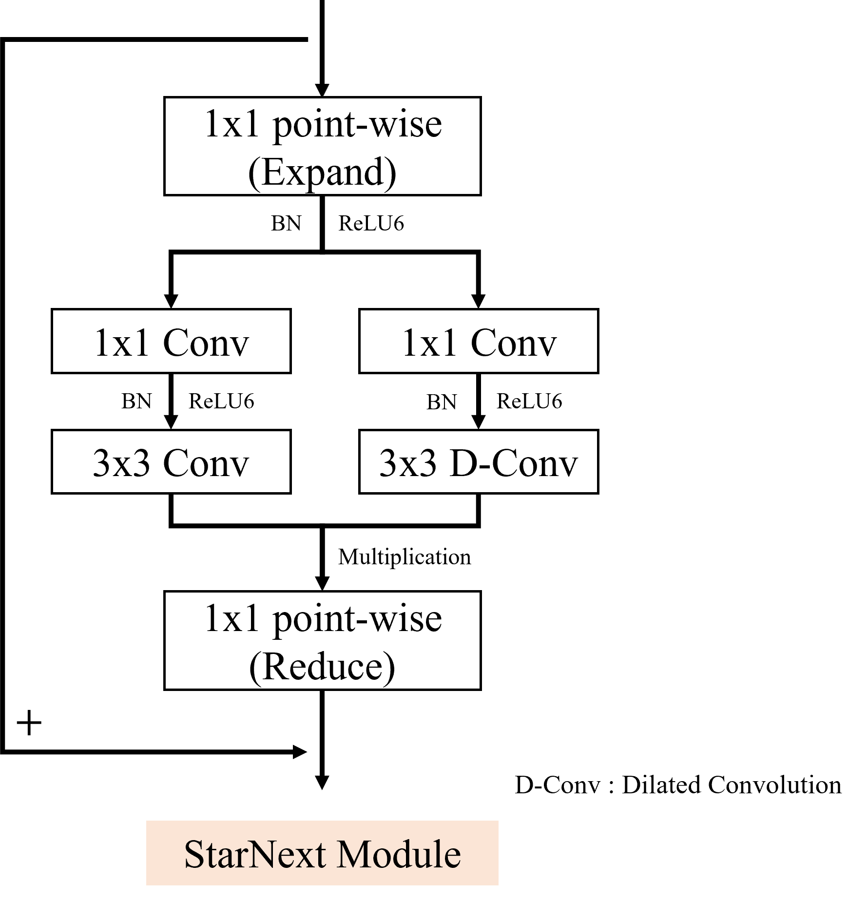
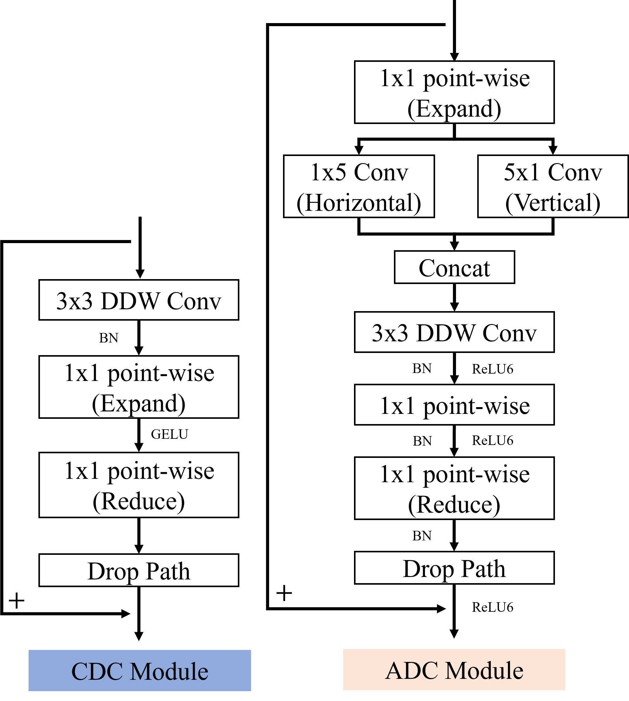
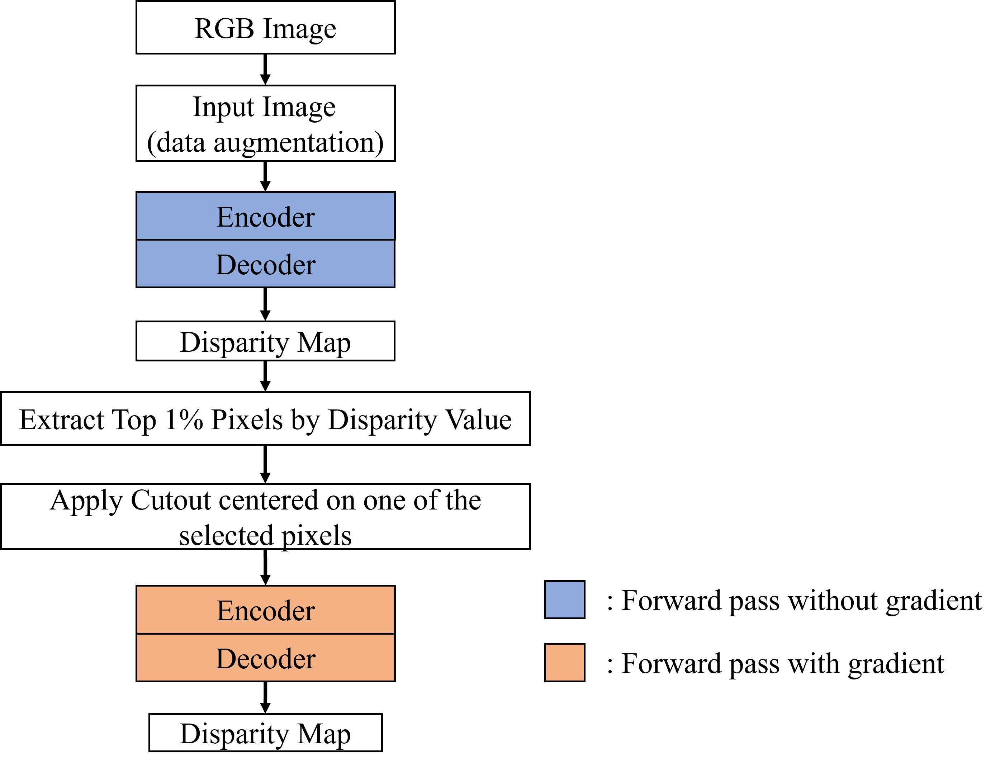

# LiteNeXtDepth

**A Lightweight Self-Supervised Monocular Depth Estimation Network for Real-Time Inference on Power-Constrained Edge Devices**

> Jaeyoung Lee, Dong-Eui University

[](#license)
[](https://pytorch.org/)
[](https://www.nvidia.com/en-us/autonomous-machines/embedded-systems/jetson-orin/)

<p align="center">
  
</p>

LiteNeXtDepth re-engineers [Lite-Mono](https://github.com/noahzn/Lite-Mono) from the ground up with a single goal: **break the 30-FPS real-time barrier on a Jetson Orin Nano 8GB across every power mode — including the most restrictive 7W profile**. It does so without sacrificing the accuracy that makes self-supervised MDE practical for autonomous driving and mobile robotics.

---

## ✨ Why this work?

Lightweight MDE models have steadily shrunk parameter counts, but **real edge platforms care about wall-clock latency under power caps**, not just FLOPs on a desktop GPU. On a Jetson Orin Nano 8GB, even Lite-Mono — already a strong lightweight baseline — exceeds the 33.3 ms (30 FPS) budget under 7W mode. That leaves no headroom for the auxiliary AI modules and downstream logic that any real autonomous system needs to run alongside depth.

LiteNeXtDepth tackles this head-on with four targeted designs:

| Component                                       | What it does                                                                                                                                                                                                         | Where it lives     |
| ----------------------------------------------- | -------------------------------------------------------------------------------------------------------------------------------------------------------------------------------------------------------------------- | ------------------ |
| **ADC Module** (Asymmetric Dilated Convolution) | Captures horizontal/vertical structural cues that dominate driving scenes (poles, signs, lane markings) using 1×5 and 5×1 asymmetric kernels fused with a dilated DWConv inside an inverted residual bottleneck      | All encoder stages |
| **StarNext Module**                             | Uses the _Star Operation_ (element-wise multiplication of two parallel branches) to project features into an implicit high-dimensional space — restoring local representational capacity _without_ widening channels | Stage 2 (high-res) |
| **Disparity-Guided Cutout**                     | Reads the model's own predicted disparity, picks a top-1% (i.e., closest) pixel below the horizon, and zero-masks its neighborhood — forcing the model to actively learn near-range structure                        | Data augmentation  |
| **Restricted Random Crop**                      | Crops to 85–95% of the original frame and resizes back, gently zooming in on near-range objects without destabilizing the lightweight network                                                                        | Data augmentation  |

The result: **~50% fewer parameters, ~58% fewer GFLOPs, ~46–52% faster inference across all Jetson power modes** — while matching or beating Lite-Mono on AbsRel and δ₁.

---

## 📑 Contents

- [Architecture](#-architecture)
- [Results](#-results)
  - [KITTI Eigen Split](#kitti-eigen-split)
  - [Jetson Orin Nano — All Power Modes](#jetson-orin-nano--all-power-modes)
  - [Ablation Study](#ablation-study)
- [Setup](#-setup)
- [Data Preparation](#-data-preparation)
- [Training](#-training)
- [Evaluation](#-evaluation)
- [Single-Image Inference](#-single-image-inference)
- [Deploying to Jetson Orin Nano (TensorRT)](#-deploying-to-jetson-orin-nano-tensorrt)
- [Project Structure](#-project-structure)
- [Acknowledgements](#-acknowledgements)
- [Citation](#-citation)

---

## 🏗 Architecture

<p align="center">
  
</p>

LiteNeXtDepth follows an encoder–decoder design with a separate ResNet-18 PoseNet for camera ego-motion. The encoder has **four progressive stages** with channel widths chosen as **integer multiples of the GPU compute unit** (C₁=32, C₂=64, C₃=128) so they map cleanly onto the Orin's SIMT execution model. Multi-scale features are aggregated by **addition** rather than concatenation to keep channel counts (and therefore memory traffic) flat.

The two custom blocks:

<p align="center">
  
  &nbsp;&nbsp;&nbsp;
  
</p>

**StarNext** (left) splits the expanded feature into two parallel branches — one 3×3 standard convolution and one 3×3 dilated convolution — and fuses them with an element-wise product. This single multiplicative gate is the key trick: it implicitly synthesizes pairwise channel combinations equivalent to a polynomial-kernel projection, multiplying expressive capacity _without_ multiplying parameters.

**ADC** (right) replaces Lite-Mono's CDC. It first passes the input through a horizontal 1×5 and a vertical 5×1 convolution in parallel, concatenates them, then applies a 3×3 dilated depthwise convolution. The asymmetric kernels make the directional bias explicit — exactly the inductive prior you want for street-scene depth, where most depth discontinuities are vertical (poles, building edges) or horizontal (road, curbs).

### Training Pipeline

<p align="center">
  
</p>

A single training step runs the network **twice**: a no-grad forward pass first produces a disparity map, from which Disparity-Guided Cutout picks a near-range pixel and masks its neighborhood. Only the second forward pass — on the masked input — receives gradients. This self-bootstrapping loop is what makes the augmentation adaptive: as the model improves, its near-range targeting also sharpens.

---

## 📊 Results

### KITTI Eigen Split

Evaluated on the standard 697 test images at 192×640 input resolution. Lower is better for the error metrics on the left; higher is better for the δ accuracy metrics on the right.

| Model                    |     Params |    GFLOPs | AbsRel&nbsp;↓ | SqRel&nbsp;↓ | RMSE&nbsp;↓ | RMSE&nbsp;log&nbsp;↓ | δ&nbsp;<&nbsp;1.25&nbsp;↑ | δ&nbsp;<&nbsp;1.25²&nbsp;↑ | δ&nbsp;<&nbsp;1.25³&nbsp;↑ |
| ------------------------ | ---------: | --------: | ------------: | -----------: | ----------: | -------------------: | ------------------------: | -------------------------: | -------------------------: |
| Lite-Mono                |     3.069M |     5.032 |         0.116 |    **0.837** |   **4.740** |                0.194 |                     0.871 |                      0.958 |                  **0.981** |
| **LiteNeXtDepth (Ours)** | **1.520M** | **2.079** |     **0.115** |        0.852 |       4.752 |                0.194 |                     0.871 |                      0.958 |                      0.980 |

Comparable accuracy with **half the parameters and 58% less compute**.

### Jetson Orin Nano — All Power Modes

Inference times are averaged over 697 KITTI test images after TensorRT optimization, with `jetson_clocks` enabled to lock CPU/GPU/EMC frequencies.

| Power Mode |    Lite-Mono | **LiteNeXtDepth** |   Speedup | 30 FPS budget |
| ---------- | -----------: | ----------------: | --------: | :-----------: |
| MaxN Super |     9.624 ms |      **5.196 ms** | **46.0%** |    ✅ both    |
| 25 W       |    10.476 ms |      **5.652 ms** | **46.1%** |    ✅ both    |
| 15 W       |    16.934 ms |      **9.098 ms** | **46.3%** |    ✅ both    |
| **7 W**    | 36.613 ms ❌ |  **17.583 ms** ✅ | **52.0%** |   only ours   |

The 7W column is the headline: **Lite-Mono blows the real-time budget; LiteNeXtDepth comes in at half the budget**, leaving room for the rest of the perception stack.

### Ablation Study

With Restricted Random Crop enabled. Removing each component degrades the metric most aligned with what that component was designed for:

| Configuration               |  AbsRel ↓ |   SqRel ↓ |    RMSE ↓ |      δ₁ ↑ |
| --------------------------- | --------: | --------: | --------: | --------: |
| w/o ADC                     |     0.127 |     0.928 |     5.031 |     0.845 |
| w/o StarNext                |     0.120 |     0.923 |     4.914 |     0.863 |
| w/o Disparity-Guided Cutout |     0.122 |     0.909 |     4.964 |     0.857 |
| **All (Ours)**              | **0.115** | **0.852** | **4.752** | **0.871** |

SqRel is the primary near-range metric — its denominator scales with depth, so close-range errors dominate. Disparity-Guided Cutout drives **~3.4% SqRel improvement** over a naive bottom-half random Cutout baseline (0.882 → 0.852), confirming that _adaptive_ near-range targeting beats _positional_ near-range priors.

---

## 🛠 Setup

### Environment

Tested on Ubuntu 20.04 with CUDA 11.x and an RTX 4090 for training, and JetPack 5.x on Jetson Orin Nano 8GB for deployment.

```bash
# Create env
conda create -n litenext python=3.9 -y
conda activate litenext

# Core deps
pip install torch torchvision torchaudio
pip install timm tensorboardX scikit-image opencv-python pillow numpy

# Custom LR scheduler used by the trainer
pip install 'git+https://github.com/saadnaeem-dev/pytorch-linear-warmup-cosine-annealing-warm-restarts-weight-decay'
```

### Hyperparameters used in the paper

| Setting               | Value                          |
| --------------------- | ------------------------------ |
| Batch size            | 12                             |
| Epochs                | 100                            |
| Input resolution      | 192 × 640                      |
| Optimizer             | AdamW                          |
| Scheduler             | Cosine Annealing Warm Restarts |
| Initial LR (DepthNet) | 5e-4 → min 5e-6                |
| Initial LR (PoseNet)  | 1e-4 → min 1e-5                |
| First cycle length    | 35 epochs                      |
| ImageNet pretraining  | Not used                       |

---

## 📁 Data Preparation

The KITTI raw dataset is required. Follow the [Monodepth2 data preparation instructions](https://github.com/nianticlabs/monodepth2#-kitti-training-data) to download and unpack it. After preparation, your directory should look like:

```
kitti_data/
├── 2011_09_26/
│   ├── 2011_09_26_drive_0001_sync/
│   │   ├── image_02/data/*.png
│   │   ├── image_03/data/*.png
│   │   └── velodyne_points/data/*.bin
│   └── ...
├── 2011_09_28/
└── ...
```

We use the **Eigen split** (38,383 train / 4,267 val / 697 test) — the split files live under `splits/eigen_zhou/`.

---

## 🚀 Training

```bash
python train.py \
    --data_path /path/to/kitti_data \
    --model_name litenext_v1 \
    --num_epochs 100 \
    --batch_size 12 \
    --height 192 --width 640 \
    --lr 0.0005 5e-6 35 0.0001 1e-5 35
```

The `--lr` argument takes six values: `[depth_max, depth_min, depth_T0, pose_max, pose_min, pose_T0]`.

Checkpoints and TensorBoard logs are written to `./tmp/<model_name>/`.

```bash
tensorboard --logdir ./tmp/litenext_v1
```

### Resuming from a checkpoint

```bash
python train.py \
    --data_path /path/to/kitti_data \
    --model_name litenext_v1_continue \
    --load_weights_folder ./tmp/litenext_v1/models/weights_49 \
    --num_epochs 100 --batch_size 12
```

---

## 📐 Evaluation

```bash
python evaluate_depth.py \
    --load_weights_folder /path/to/weights/folder \
    --data_path /path/to/kitti_data \
    --eval_mono
```

This reports the seven standard metrics (AbsRel, SqRel, RMSE, RMSE log, δ < 1.25ⁿ for n=1,2,3) using the Garg/Eigen crop.

---

## 🖼 Single-Image Inference

```bash
python test_simple.py \
    --load_weights_folder /path/to/weights/folder \
    --image_path /path/to/your/image_or_folder
```

Outputs a colorized disparity visualization next to the input file.

---

## ⚡ Deploying to Jetson Orin Nano (TensorRT)

The headline numbers above come from a TensorRT-optimized FP16 engine.
We provide a single script that handles the full **PyTorch → ONNX → optimized ONNX → TensorRT engine** pipeline.

### 1. Build the engine

Run this _on the target Jetson device_ — TensorRT engines are device- and
TensorRT-version-specific, so building on the desktop won't work for deployment.

```bash
python convert_to_trt.py \
    --weights ./tmp/litenext_v1/models/weights_99 \
    --output  ./trt_engine \
    --model-name litenext_v1 \
    --height 192 --width 640
```

This produces three files under `./trt_engine/`:

| File                      | Purpose                                                        |
| ------------------------- | -------------------------------------------------------------- |
| `litenext_v1.onnx`        | Raw ONNX export from PyTorch                                   |
| `litenext_v1_opt.onnx`    | Graph-optimized ONNX (BN/Conv fusion, INT64→INT32 cast)        |
| `litenext_v1_fp16.engine` | Final serialized TensorRT engine — load this at inference time |

### 2. Lock the Jetson clocks before benchmarking

```bash
sudo nvpmodel -m 0    # 0 = MaxN, 1 = 7W, 2 = 15W, 3 = 25W (see your nvpmodel.conf)
sudo jetson_clocks    # pin CPU/GPU/EMC to max within the selected power mode
```

For clean inference-time numbers, warm up with at least 20 forward passes
before timing, and use `cudaEventRecord` rather than Python wall-clock.

---

## 📂 Project Structure

```
.
├── train.py                    # Entry point
├── trainer.py                  # Training loop + Disparity-Guided Cutout logic
├── options.py                  # CLI argument definitions
├── evaluate_depth.py           # KITTI evaluation
├── test_simple.py              # Single-image inference
├── networks/
│   ├── depth_encoder.py        # LiteNeXtDepth encoder
│   ├── depth_decoder.py        # Multi-scale disparity decoder
│   ├── pose_decoder.py         # PoseNet decoder
│   ├── resnet_encoder.py       # PoseNet backbone (ResNet-18)
│   ├── core_layer.py           # ADC, StarNext, LGFI, XCA
│   └── custom_layers.py        # StandardConv, DepthwiseSeparable, LayerNorm
├── datasets/
│   ├── mono_dataset.py         # Base loader + Restricted Random Crop
│   └── kitti_dataset.py        # KITTI specifics
├── splits/                     # Train/val/test file lists (Eigen, etc.)
└── assets/                     # README figures and demo
```

---

## 🙏 Acknowledgements

This project stands on the shoulders of two excellent codebases:

- [**Lite-Mono**](https://github.com/noahzn/Lite-Mono) by Zhang et al. (CVPR 2023) — the baseline architecture and the LGFI / XCA blocks reused here.
- [**Monodepth2**](https://github.com/nianticlabs/monodepth2) by Godard et al. (ICCV 2019) — the self-supervised training framework, photometric reprojection loss, auto-masking, and the KITTI evaluation pipeline.

The Star Operation that powers StarNext was introduced in [Rewrite the Stars](https://github.com/ma-xu/Rewrite-the-Stars) (Ma et al., CVPR 2024). The asymmetric convolution design takes inspiration from [ACNet](https://github.com/DingXiaoH/ACNet) and [InceptionNeXt](https://github.com/sail-sg/inceptionnext).

---

## 📜 Citation

If you find this work useful in your research, please consider citing:

```bibtex
@article{lee2026litenextdepth,
  title   = {A Lightweight Self-Supervised Monocular Depth Estimation Network
             for Real-Time Inference on Edge Devices},
  author  = {Lee, Jaeyoung},
  journal = {IEEE Access},
  year    = {2026}
}
```

And please also cite the works this repository builds upon:

```bibtex
@inproceedings{zhang2023litemono,
  title     = {Lite-Mono: A Lightweight {CNN} and Transformer Architecture
               for Self-Supervised Monocular Depth Estimation},
  author    = {Zhang, Ning and Nex, Francesco and Vosselman, George and Kerle, Norman},
  booktitle = {CVPR},
  year      = {2023}
}

@inproceedings{godard2019monodepth2,
  title     = {Digging into Self-Supervised Monocular Depth Estimation},
  author    = {Godard, Cl{\'e}ment and Mac Aodha, Oisin and Firman, Michael
               and Brostow, Gabriel J.},
  booktitle = {ICCV},
  year      = {2019}
}
```

---

## 📄 License

This project is released under the MIT License. Portions of the code derived from Lite-Mono and Monodepth2 retain their original licenses — please consult those repositories for the exact terms.

---

<p align="center">
  <em>Built for the edge. Tuned on KITTI. Verified on Jetson.</em>
</p>
